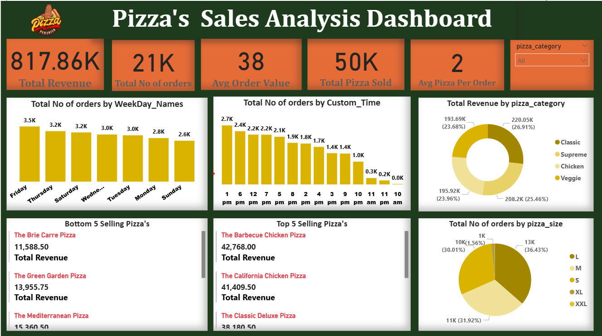

# 🍕 Pizza Sales Analysis Dashboard  

A dynamic and interactive **Power BI dashboard** designed to analyze pizza sales performance. This dashboard provides insights into revenue, orders, pizza categories, customer preferences, and time-based sales trends, helping businesses make data-driven decisions to boost sales and efficiency.  

---

## 📌 Project Purpose  
The Pizza Sales Analysis Dashboard aims to provide a **comprehensive view of sales performance** across different dimensions like **pizza category, size, weekday trends, and customer order behavior**. It helps managers, analysts, and stakeholders identify **top-selling products, revenue drivers, and low-performing items** to optimize business strategy.  

---

## 🛠️ Tech Stack  
The dashboard was built using the following tools and technologies:  
- 📊 **Power BI Desktop** – For data visualization and interactive reporting.  
- 📂 **Power Query** – Used for data cleaning, transformation, and shaping.  
- 🧮 **DAX (Data Analysis Expressions)** – For calculated measures and dynamic KPIs.  
- 📝 **Data Modeling** – Relationships established among tables to enable cross-filtering.  
- 📁 **File Format** – `.pbix` for development, `.csv` for dataset, `.png` for dashboard preview.  

---

## 📂 Data Source  
- **Dataset**: `pizza_sales.csv`  
- Contains order-level transaction data including **pizza name, category, size, order time, quantity, and price**.  
- Data was preprocessed in **Power Query** for consistency and modeling.
- Datasource:https:-//www.kaggle.com/datasets/nextmillionaire/pizza-sales-dataset 

---

## ⭐ Dashboard Features & Highlights  

### 🔹 Business Problem  
The pizza chain generates thousands of sales across multiple categories and sizes, but **management lacked visibility** into sales performance trends and customer ordering behavior. Key questions like:  
- Which pizzas generate the most revenue?  
- What days and times see the highest sales?  
- Which pizza sizes are most preferred by customers?  
… were difficult to answer with raw transactional data.  

### 🔹 Goal of the Dashboard  
To deliver an **interactive analytics tool** that:  
- Tracks revenue and order performance.  
- Identifies **top & bottom selling pizzas**.  
- Reveals **customer order patterns** by day and time.  
- Compares performance across **pizza categories and sizes**.  
- Helps in **data-driven decision-making** for sales strategy and inventory planning.  

### 🔹 Walkthrough of Key Visuals  

- **KPIs (Top Cards)**  
  - Total Revenue: **817.86K**  
  - Total Orders: **21K**  
  - Avg Order Value: **38**  
  - Total Pizzas Sold: **50K**  
  - Avg Pizzas per Order: **2**  

- **Orders by Weekday** – Identifies peak days (e.g., **Friday with 3.5K orders**).  
- **Orders by Time of Day** – Shows customer activity, with peak sales between **12–7 PM**.  
- **Revenue by Category (Donut Chart)** – Breakdown across **Classic, Supreme, Chicken, Veggie**.  
- **Orders by Pizza Size (Pie Chart)** – Highlights size preferences (**L = 36.43%, M = 31.92%, S = 30.01%**).  
- **Top 5 Selling Pizzas (Bar Chart)** – E.g., *Barbecue Chicken Pizza = 42,768 revenue*.  
- **Bottom 5 Selling Pizzas (Bar Chart)** – E.g., *Brie Carre Pizza = 11,588 revenue*.  

### 🔹 Business Impact & Insights  
- **Product Optimization**: Identifies best & worst performers for menu adjustments.  
- **Sales Strategy**: Target promotions on low-order weekdays to boost revenue.  
- **Customer Insights**: Evening times (6–8 PM) show peak demand → optimize staffing.  
- **Category Performance**: *Supreme pizzas* lead in revenue (26.91%).  
- **Size Preference**: Large pizzas dominate sales (36.43%).  

---

## 📸 Dashboard Preview  

  

---

## 🚀 How to Use  
1. Download the `.pbix` file: **Pizza Sales Analysis Dashboard.pbix**  
2. Open in **Power BI Desktop**.  
3. Connect to the dataset `pizza_sales.csv` if needed.  
4. Explore the dashboard interactively with filters and slicers.  

---

## 📌 Key Files in Repository  
- `pizza_sales.csv` → Dataset  
- `Pizza Sales Analysis Dashboard.pbix` → Power BI dashboard file  
- `Pizza_Dashboard.png` → Dashboard preview screenshot  
- `README.md` → Documentation  

---
